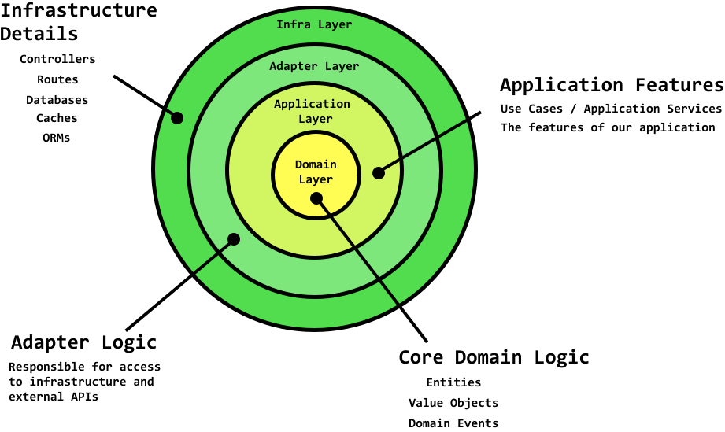

- Knowing When CRUD & MVC Isn't Enough
	- MVC没有阐明的问题，business logic放在哪里
		- 随着业务的复杂化，一个函数会负担太多责任
	- Domain-Modal通过Domain Events来组织各子域
- 
- 为什么要将关注点分离到各层
	- 即使业务变得越来越复杂，也能顺利地添加新功能
- 常用的软件分层：
- 表现层：关注如何向用户展示的逻辑
	- 分容器组件和展示组件。容器组件维持状态，提供方法。
- Adapter logic：关注如何反问基础层的逻辑
	- 如何访问基础层，如缓存，数据库
	- example
		- RESTful APIs: Define a RESTful API with Express.js and create controllers to accept requests.
		- Production middleware:Write Express.js controller middleware to protect your API from things like DDos and brute force login attempts.
		- Database Access: Create repositories that contain methods that perform CRUD on a database. Use either an ORM like Sequelize and TypeORM or raw queries to do this.
		- Billing Integrations: Create an adapter to a payment processor like Stripe or Paypal so that it can be used by inner layers.
- Application Logic / Use case：关注应用实际需求的逻辑
	- [[Use cases]] are the features of our app
	- use cases要不是命令，要不就是查询，不能两者都是
- Domain Service logic：涉及多个实体的核心业务逻辑
	- 需要多个实体的核心业务逻辑
- Validation logic：关注于验证domain object
	- 使用value object封装对model属性的验证
- Core business logic/ entity logic： 属于单个实例的逻辑
- npm
	- inversify