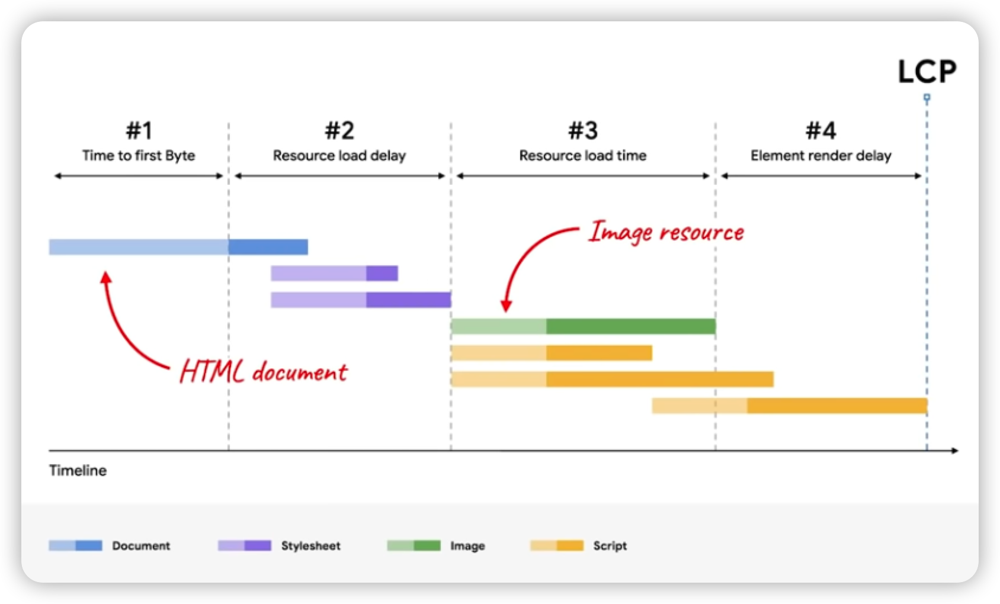

- 网页加载过程
	- {:height 309, :width 498}
- 优化
	- 减少不必要的资源延迟
		- 使用preload, priority hints
			- preload优先级大于prefetch
			- 比如preload image
		- Minimize network contention
		- use same-origin resource (if possible)
	- 减少不必要的element render delay
		- 删除或缩小css或js文件，
			- 加载没样式的页面是不好，但css如果过大，可以考虑拆分或inline
			- css加载不阻塞dom解析，但会阻塞dom渲染
			- css加载会阻塞后面js语句的执行
		- defer js，或者module js，两者都只加载，不阻塞渲染
		- font-display optional
		- 使用ssr提前生成网页，极大地减少element render delay
	- 减少资源加载时间
		- use cdn to reduce network distance
		- compress pic
		- use modern image format avif/webp
		- properly size image
		- set far-future cache expiry headers
	-
	-
	-
	-
	-