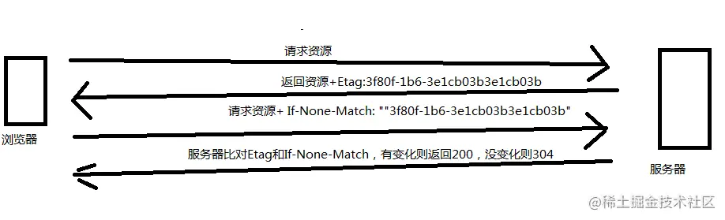

- 怎么解决边距重叠？使用BFC
  collapsed:: true
	- BFC让空间中的子元素不会影响到外面的布局
	- 触发BFC的方法
		- body，
		- float除none以外，
		- position：absolute,fix,
		- overflow:hidden,scroll,auto,
		- display：flex
	- 应用
		- 边距不重叠
		- 清除内部浮动和外部浮动
- 事件
	- currentTarget 绑定事件函数的元素
	- target触发事件的函数
- web storage
  collapsed:: true
	- cookie
		- 可以设置失效时间，浏览器关后还在
		- 通过设置expires来设置过期时间：document.cookie = 'foo=bar;path=/;expires='+d.toGMTString()+';'*;*
	- sessionStorage
		- 每个tab的seesionStorage都是独立的
		- 数据不会发到server
		- 当tab关闭时，stores data会被清空
		- 存的数据比cookie多，最多5mb
	- localStorage基本相同，除了：
		- 直到浏览器关闭，data都还在
		- stores data没有过期时间
		- 根据origin独立
- 强缓存、协商缓存
  collapsed:: true
	- 强缓存通过响应头来控制
		- cache-control： public, max-age=31536000
		- 直接从本地读，返回200
	- 协商缓存, no-chache
		- 由服务器确定是否可用
		- last-modified/if-modified-Since
		- Etag/If-None-Match
			- 
		- 如果无变化则返回304，有变化则200
	- 不缓存，no-store
- 盒模型
	- box-sizing:content-box : width = content(100%) + border + padding
	- box-sizing: border-box : width(100%) = content + border + padding
- 跨域
	- 当一个请求url的协议、域名、端口三者之间任意一个与当前页面url不同即为跨域，
	- 除get和搭配某些MIMIE类型的POST以外，都需要cors
- chrome的最大连接并发数是6。因为从http1.1开始支持设置长连接，为了防止dos攻击，所以限制连接并发数
- BEM
	- https://en.bem.info/methodology/quick-start/
	- block是根据功能来划分，可以被复用
	- element是block的部分，不能脱离block单独使用
		- element间可以嵌套，但不能是另一个element的部分
		- 通过__分割，search-form__input
	- Modifier
		- 通过_分割，search-form__button_size_s