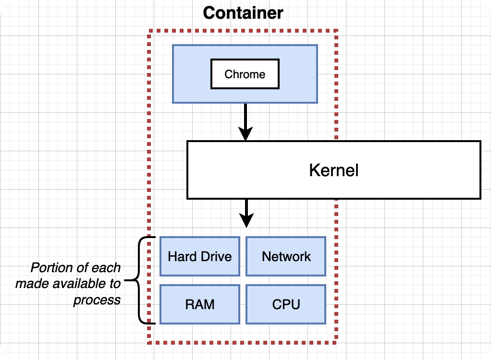

- why use docker
	- docker可以将程序打包成可移植的容器，在任何支持 Docker 的环境中运行
	- docker容器效率更高，可以在同一主机上共享操作系统内核，这使得它们比虚拟机更轻量级和高效。相对的，docker容器的启动速度也更快
- what is docker
	- Docker is a platform or ecosystem around creating and running containers
- what is container
	- 
	- 每个contianer都有独立的process和资源，这依靠linux的两个特性：
		- Namespacing: Isolating resources per process (or group of processes)
			- Processes, Users, Hard drive, Network
		- Control Groups(cgroups): limit amount of resources used per process
			- Memory, CPU Usage, Network Bandwith
	- containers共用Kernel
	- 因为windows没有以上两个特性，所以所有container都套在一个 Linux Virtual Machine。
- docker run image-name command(default command override)
- docker ps
	- docker ps --all, 展示所有创建过的container
- docker start container-id
- docker system prune
- docker log container-id
- docker stop，十秒后自动调用docker kill
- docker kill, 马上结束
- docker exec -it container-id command, execute an additional command in a container
- -it
	- `-i`  表示交互式模式，意思是会打开容器的标准输入，以便您可以在容器内进行交互。
	- `-t`  表示会分配一个伪终端（pseudo-tty），意思是会在容器内创建一个虚拟终端，以便您可以通过该虚拟终端与容器交互。
- docker exec -it container-id sh, 进入容器内部
- docker run -it container-is sh
- dockerfile -> docker client -> docker server -> usable image
- docker build -t containerId/projectName/version
- docker run -p local-port:container-port container-id
- COPY  build context path  container internal path
- WORKDIR  /usr/app
-