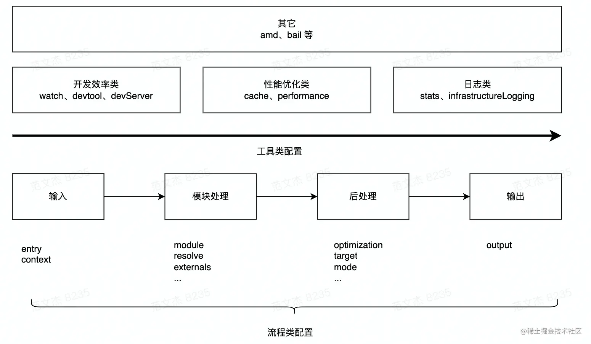

- 什么是前端工程化
	- 工程化工具能不同程度弥补浏览器，语言，规范本身的设计缺陷，让我们专注在开放上。
	- 一套足够开放，能融合诸多工程化工具，彻底抹平开发与生产环境差异的一体化工程方案，是webpack的目标
- webpack配置底层配置逻辑：
	- 
	- optimization：用于优化产物包的体积，内置 Dead Code Elimination、Scope Hoisting、代码混淆、代码压缩等功能。
	- 模块处理完毕后，最后**再根据**后处理相关配置项( `optimization/target`  等)合并模块资源、注入运行时依赖、优化产物结构等。
- 如何借助预处理器，PostCSS等构件现代CSS工程环境
	- PostCSS 并没有定义一门新的语言，而是与  `@babel/core`  类似，只是实现了一套将 CSS 源码解析为 AST 结构，并传入 PostCSS 插件做处理的流程框架，具体功能都由插件实现，如：
		- autoPrefixer，postcss-preset-env, postcss-less, stylelint
			-
		-