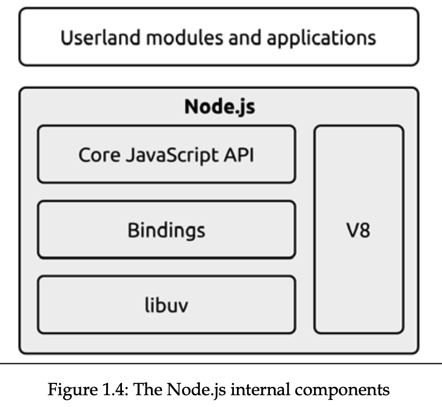

title:: 《Node.js Design Patterns》

- How nodejs works
  collapsed:: true
	- IO is slow
		- 访问RAM的速度是纳秒级的（10E-9秒），而访问磁盘或网络上的数据的速度是
		  毫秒（10E-3秒）。这同样适用于带宽。RAM的传输速率始终在GB/s的数量级，而磁盘或网络的传输速率从MB/s到乐观的GB/s不等。就CPU而言，I/O通常并不昂贵，但它在请求被发送到设备的那一刻和操作完成的那一刻之间增加了一个延迟。
		- 除此之外，我们还必须考虑人为因素。事实上，在很多情况下，应用程序的输入来自于一个真实的人--例如鼠标点击--所以I/O的速度和频率不仅仅取决于技术方面，它可能比磁盘或网络慢很多个数量级。
	- no-blocking IO
		- no-blocking 就是返回一个等待状态，等资源可用了，再切换状态
		- 轮询资源通常会浪费大量的cpu
	- Event demultiplexing
		- 该技术能在一个单线程内处理多个I/O操作，而不需要使用busy-waiting技术
		- 从轮询资源到轮询单个线程内是否有事件
		- 一个IO操作可能被Event demultiplexing 分解为多个event
	- reactor pattern
		- Handles I/O by blocking until new events are available from a set of observed resources, and then reacts by dispatching each event to an associated handler.
	- Libuv, the I/O engine of Node.js
		- 每个操作系统都有自己的事件解复用器接口：Linux上的epoll，macOS上的kqueue，以及Windows上的I/O完成端口（IOCP）API。除此之外，每个I/O操作的行为都会有很大的不同，这取决于资源的类型。
		  资源的类型不同，每个I/O操作的表现也大不相同，即使是在同一个操作系统中。例如，在Unix操作系统中，普通的文件系统文件不支持非阻塞操作，所以为了模拟非阻塞行为，有必要在事件循环之外使用一个单独的线程。
		- 所有这些在不同操作系统之间和内部的不一致都要求
		  需要为事件解复用器建立一个更高层次的抽象。这正是Node.js核心团队创建一个名为libuv的本地库的原因，其目的是使Node.js与所有主要的操作系统兼容，并使不同类型资源的非阻塞行为正常化。Libuv代表了Node.js的低级I/O引擎，它可能是Node.js建立的最重要的组件。
		- 除了抽象出底层的系统调用外，libuv还实现了反应器模式，从而为创建事件循环、管理事件队列、运行异步I/O操作和其他类型的任务队列提供了一个API。
	- the recipe of Node.js
		- binding负责封装和暴露libuv和其他底层功能，给JS
		- a core JS API实现high-level Nodejs API.
		- 
- Javascript in Node.js
  collapsed:: true
	- running native code
		- Node-API is an API for building native Addons.
		- wasm： 一种低级别的指令格式，允许我们将JavaScript以外的语言（如C++或Rust）编译成JavaScript虚拟机可以 "理解 "的格式。这带来了许多
		  的优势，而不需要直接与native code对接。
- The Module System
  collapsed:: true
	- 模块系统建立模块间的依赖关系
	- CommonJS
		- CommonJS的背后一是对模块源代码的wrapper，二是运行的人工环境
		- 模块调用顺序的变化会改变循环依赖的结果
	- ESM
		- 给JavaScript一个适合不同执行环境的官方模块系统
		- 语法是非常简单和紧凑的。它支持循环的依赖关系，并且可以异步加载模块。
		- ES模块是静态的，import在模块顶部，且在控制流语句之外。另外，导入的模块名称不能在运行时使用表达式动态生成，只允许使用常量字符串。
		- loading phases
			- 收集所有需要的依赖
			- 建立依赖间的link
			- 执行模块代码
		- entities imported through ES modules are read-only live bindings
		- 解决了循环依赖
	- ESM and CommonJS differences and interoperability
		- 能在ESM中导入CommonJS
		- 不能在CommonJS中导入ESM
- Callbacks and Events
	- JavaScript是回调的理想语言，因为函数是一流的对象，可以很容易地分配给变量，作为参数传递，从另一个函数调用中返回，或存储在数据结构中。另一个实现回调的理想结构是闭包。通过闭包，我们可以引用创建函数的环境；这样一来，我们可以始终保持请求异步操作的环境。
	- the callback pattern
		- 下面是一些陷阱，和相应的解决办法
		- 一个函数不是同步，就是异步，不能不可预见
		- 必要时可使用同步，如启动应用时，加载配置文件
		- 使用process.nextTick()将同步操作异步化
			- 它接受一个回调作为参数，并将其推到事件队列的顶部，在任何待处理的I/O事件之前，并立即返回。一旦当前运行的操作将控制权交还给事件循环，该回调就会被调用。
		- `setImmediate`为一次`Event Loop`执行完毕后调用。
		- 使用callback传递错误，而非throw
		- 在process.on('uncaughtException', callback)中处理未捕获
	- The Observer pattern
		- 他能通知多个观察者，而 callback pattern只能通知callback
		- callback和eventemitter的不同
			- callback适合只有一次触发，返回失败或成功
			- eventEmitter用于交流数据，适合多次触发，触发不能类型的event
		- callback结合eventEmmiter能适配更高级的场景，如glob
- Asynchronous Control Flow Patterns with Callbacks
  collapsed:: true
	- Callback best practices and control flow patterns
		- 尽早return
		- 为回调创建命名的函数，让它们远离闭包，并将中间结果作为参数传递
		- 将代码模块化。尽可能地将代码分割成更小的、可重用的函数。
- Asynchronous Control Flow Patterns with Promises and Async/Await
  collapsed:: true
	- callback的缺点
		- 是先简单程序，过于复杂
		- 脆弱的错误管理
	- promise的优点
		- 返回一个状态
		- 处理error更简单
	- async await
		- 处理异步顺序执行链
		- 可以使用try-catch处理error
		- The problem with infinite recursive promise resolution chains
			- 使得promise和接下来promise独立开，不return 新promise
- Coding with Streams
	- stream的优点
		- memory usage
		- computation clock time
		- composability
	-