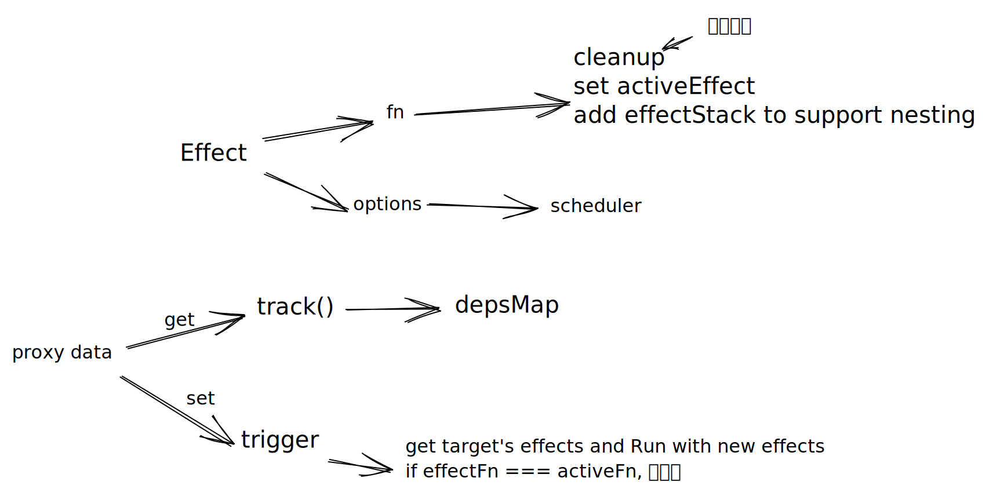
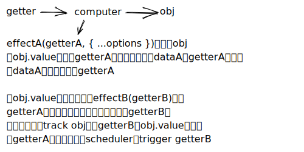
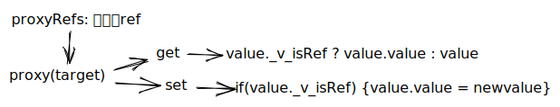

- 作用与实现
	- 
	- effect
		- effect将fn设为activeFn，使fn和响应式数据间建立关系
	- computer(getter)
		- 
	- watch(source, callback, options = {})
	  collapsed:: true
		- effect触发source的get
		- 在scheduler中调用callback（newVal, oldVal）
		- 立即执行watch，会在初始化后调用scheduler
		- 处理过期的副作用
			- ```
			  let clean: null | (() => void)
			  type AsyncFn = (value: any) => Promise<any>
			  const onClean = (cb: NoneToVoidFunction) => {
			    clean = cb
			  }
			  function expiredFn(fn: AsyncFn): Promise<any> {
			    if (clean) {
			      clean()
			    }
			    return fn(onClean)
			  }
			  let data
			  expiredFn(async (cb) => {
			    let expired = false
			  
			    cb(() => {
			      expired = true
			    })
			    const res = await Promise.resolve(1)
			    if (!expired) {
			      data = res
			    }
			  })
			  ```
- 非原始值的响应式方案
	- reflect能确保this指向的是proxy。
	- 创建proxy时指定的拦截函数，实际上是用来自定义proxy自身的内部方法和行为。
	- 如何代理object：如代理for...in,需要查阅bECMAScript规范，并找到基本操作的方法，然后实现对应的拦截函数。
	- 如何代理数组
	- 如何代理Set， Map
- 原始值的响应式方案
	- 因为proxy无法代理原始值，所以用ref生成一个包裹原始值的对象，并定义了_v_isRef来和一般对象区分
	- 响应丢失问题
		- 
	- 