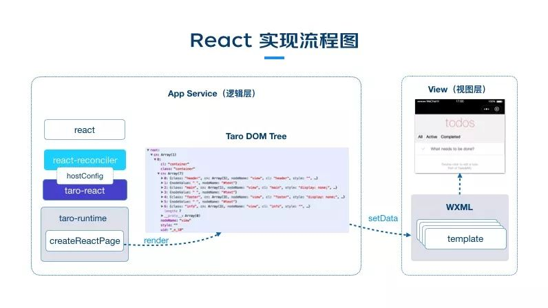

- 小程序有双架构，分为逻辑层和视图层
	- 逻辑层调用App()/Page()方法,且方法里处理数据，提供生命周期函数和事件函数。
	- 视图层提供模版和样式来渲染。
	- 逻辑层发出data，接受event。视图层发出event，接受data
- Tara的架构
	- 
	- 对标dom/bom api实现taro-runtime，即taro dom/bom api。
	- 使用taro-react来连接react-reconfiler和taro-runtime。
		- 在hostconfig里调用对应的taro bom/dom api
		- 实现render函数，来生成taro dom tree
	- 将小程序组件挨个处理成tempalte
	- 然后基于taro dom tree，递归template渲染出整棵树。