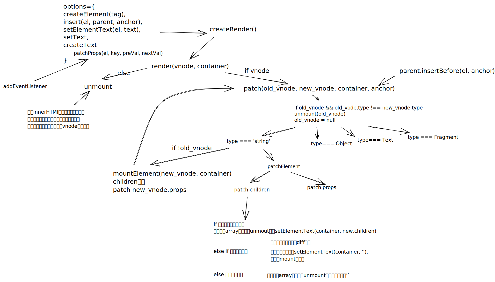

- 渲染器的设计
	- 利用响应式系统的能力，当响应式数据变化时，自动触发渲染器重渲染
	- 渲染器的作用是把vnode渲染为特定平台上的真实元素。通过将创建，修改和删除的元素抽象为可配置的对象传入render，来实现自定义渲染器，使其不绑定于特定平台。
- 挂载和更新
	- {:height 434, :width 746}
	- 事件冒泡与更新时机
		- 因为微任务会穿插在由事件冒泡发出的多个事件处理函数之间执行，即使将更新放在微任务中执行，也无法保证更新晚于触发它的事件处理函数引起的冒泡
		- 屏蔽所有绑定时间晚于触发时间的事件处理函数
- 简单diff算法
	- 步骤
		- 更新可复用dom的值或者属性
		- 调整可复用dom的位置
		- 最后是删除或添加dom
	- key的作用
		- 避免类型相同的dom节点因为顺序不同，而重新创建和删除。key可以用来对应类型相同的新旧节点。
-