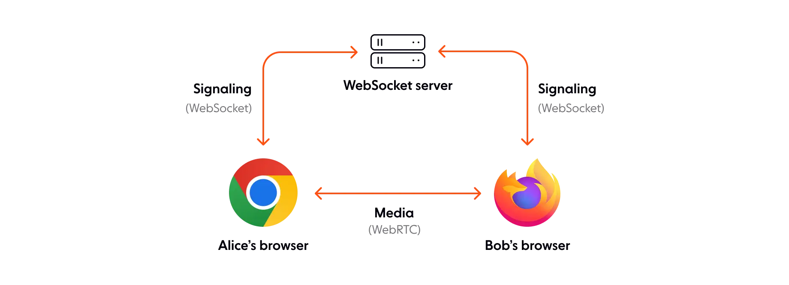
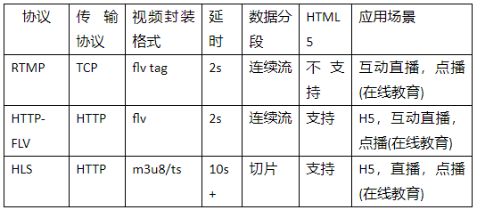

- [[入门音视频]]
-
-
- ### 播放器端
- 编解码格式
	- h264（视频）
		- safari 12.1及之前版本不支持VP8
-
- ### webrtc
	- 
	- webrtc protocol
		- 基于STUN识别出对外的socket，然后通过sdp进行握手，确认解编码，加密等信息。
		- 如果一些路由限制私网设备对外连接，需转向TURN
-
- ### rtc-mixer通过RTMP推流到cdn，再通过htls到用户端
- {:height 244, :width 535}
- rtmp
	- rtmp和http的不同
		- http基于常规的web server传输文本
		- rtmp是流媒体协议，基于stream server
- HTTP-Flv
	- FLV (Flash Video) 是 Adobe 公司推出的另一种视频格式，是一种在网络上传输的流媒体数据存储容器格式
	- RTMP/FLV标准已经超过10年没更新了，兼容性差。
	- 浏览器原生不支持
- hls
	- hls是一种切片式的直播传输格式。他基于fmp4标准，一直处于MPEG的维护中，兼容各种编码器和主流浏览器。
	- 因为hls基于文件传输，CDN部署更容易。
	- fmp4
		- 一种封装流媒体格式
		- fmp4 由一系列的片段组成，如果服务器支持 byte-range 请求，我们可以单独请求部分片段，结合[MSE](https://www.zhihu.com/question/314810515/answer/618143543)进行流式播放
-