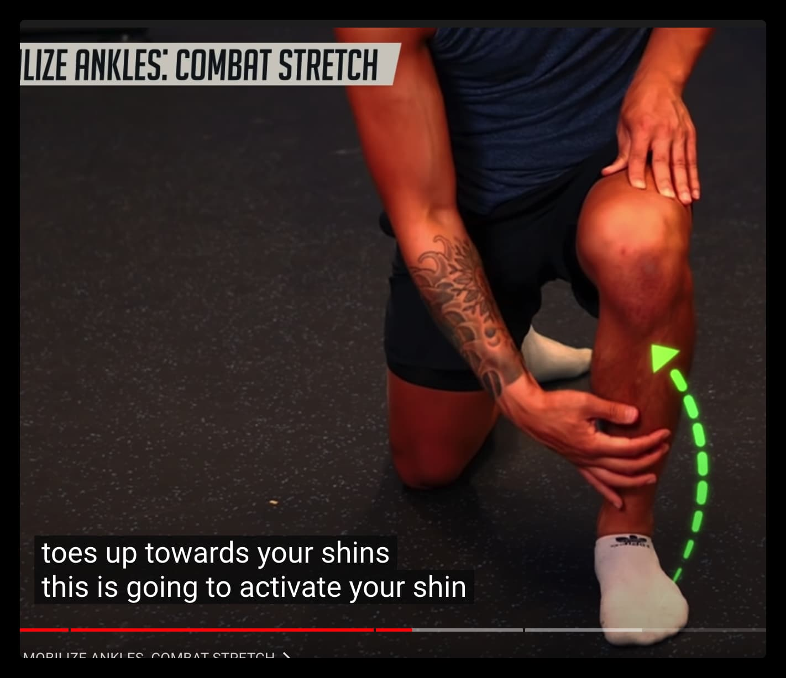
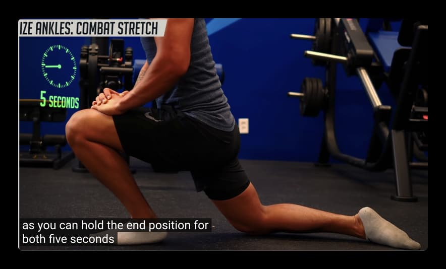
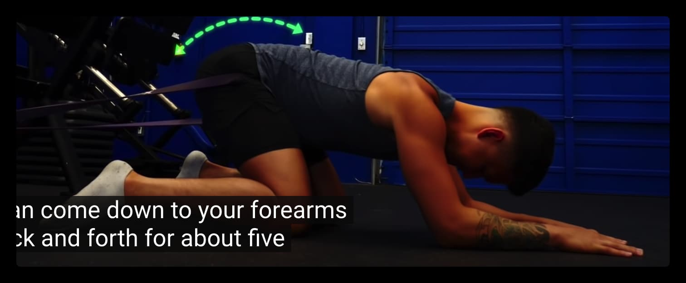
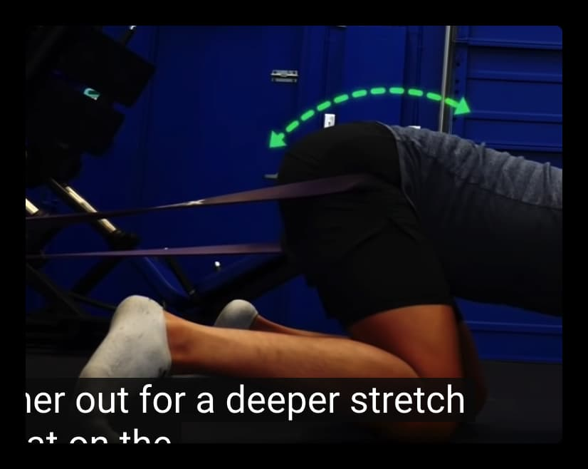
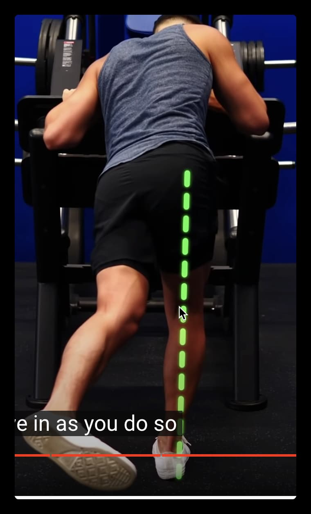
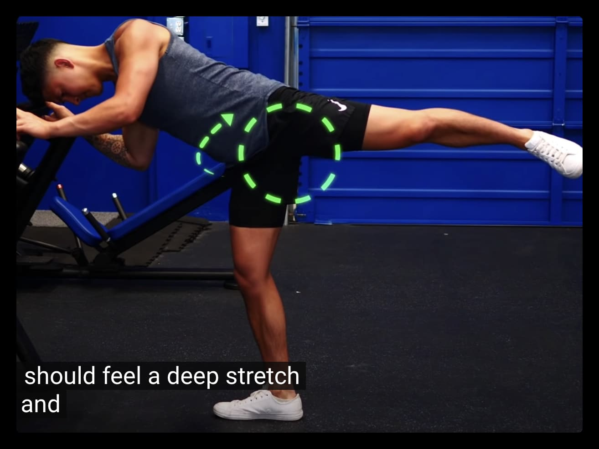
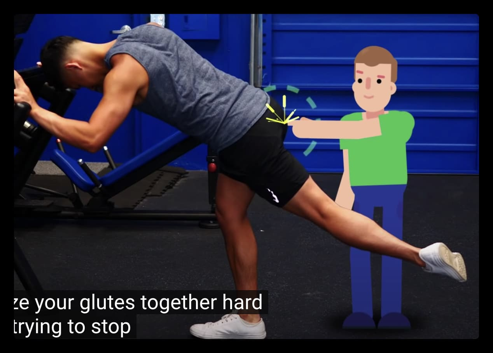
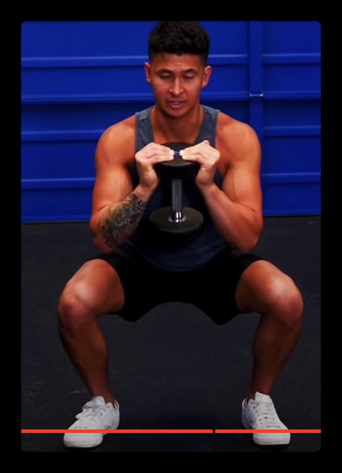
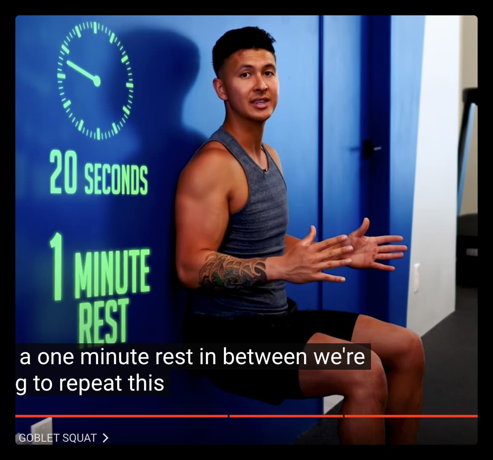

- #康复
- 测试脚踝
  1) 膝盖触及墙壁
  2) 膝盖和臀部不转入/转出
  3) 脚跟保持在地面上
  4) 两边都在一英寸之内
- 臀部测试
  仰卧，膝盖向上，双腿弯曲成90度。在保持膝盖不动的情况下，向两侧踢出你的脚，尽量踢得远一些。看一看并记下，如果两边都是均匀的，或者是一边比较紧，不能像另一边那样把脚踢出去。一旦你完成这两项测试，记下你的结果。它们是知道你需要做哪些膝关节强化练习的关键。
- 5s, 各10次
- 首先，我们将利用你的测试结果来确定你应该重点进行哪些膝关节活动度练习。因此，如果你的踝关节测试没有通过，就在你的日常训练中增加战斗拉伸。采取半跪式奔跑姿势，挺直臀部，将前膝向前顶到脚尖。当你这样做时，想一想通过驱动你的脚趾到你的小腿来拉动自己前进。在你的脚跟不抬起来的情况下，尽量走远。保持这个终点位置5秒钟，然后再重复5-10次。在换到另一侧之前，先从你比较受限的一侧开始。如果你有一个带子，把你的腿放在一个平台上，在你进行拉伸时，把带子缠在你的脚踝上面从后面拉。
- {:height 264, :width 373}
- {:height 290, :width 541}
- 5s，10次
- 而如果你在臀部内旋测试中发现了不平衡，可以加上下面的拉伸动作。臀部坐着，双臂支撑着你的身体直立，双腿伸出，保持宽阔的姿态。脚尖向上，以激活肌肉，这将有助于避免在拉伸过程中加重你的膝关节。从这里开始，将你的膝盖推向地板，直到你感觉到拉伸。保持几秒钟，然后从一边换到另一边，每次大约做5-10次。如果你有一个带子，我们可以做一个更有效的拉伸。将带子缠绕在一个低矮的固定物上，并在你较受限制的一侧的臀部绕一圈，这样它就把你拉回来了。手膝着地，把带子的那只脚踢出去，然后把屁股坐回脚跟。从这里开始，如果你可以的话，下来到你的前臂。来回摇晃约5-10次，并逐渐将腿踢出以获得更深的伸展。在另一侧重复。
- {:height 32, :width 394}
- {:height 360, :width 475}
- 臀部飞机
- {:height 393, :width 136}
- {:height 321, :width 237}
- {:height 435, :width 225}
- {:height 310, :width 196}
- {:height 406, :width 213}
-