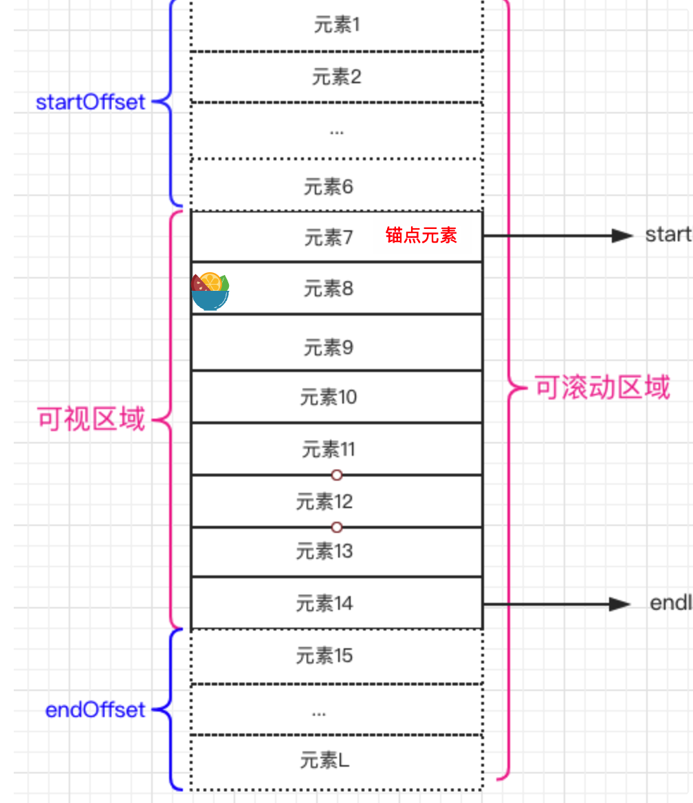

- 
- 监听滚动事件，计算出锚点元素，锚点元素的bottom要>= scrollTop，再根据锚点元素来计算start和end的值。
- 当前展示的item mounted时，将item存入cache。item包含bottom（bottom +  window.pageYOffset），向下滑动时，当scrollTop大于item.bottom时需要更新。向上滑动时，当scrollTop 小于item.top时需要更新。